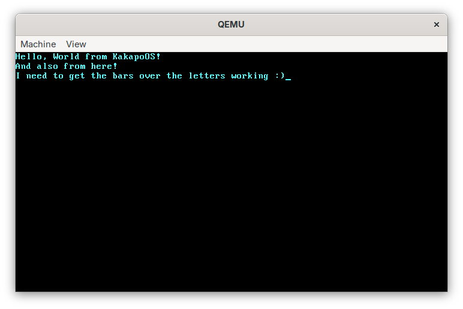

Keith's very own Operating System, Kākāpō

OSDev wiki has been used as a reference. It uses C++, though it's more of a "C, but with classes" usage

Currently, it targets x86 QEMU

What does the future hold ?

